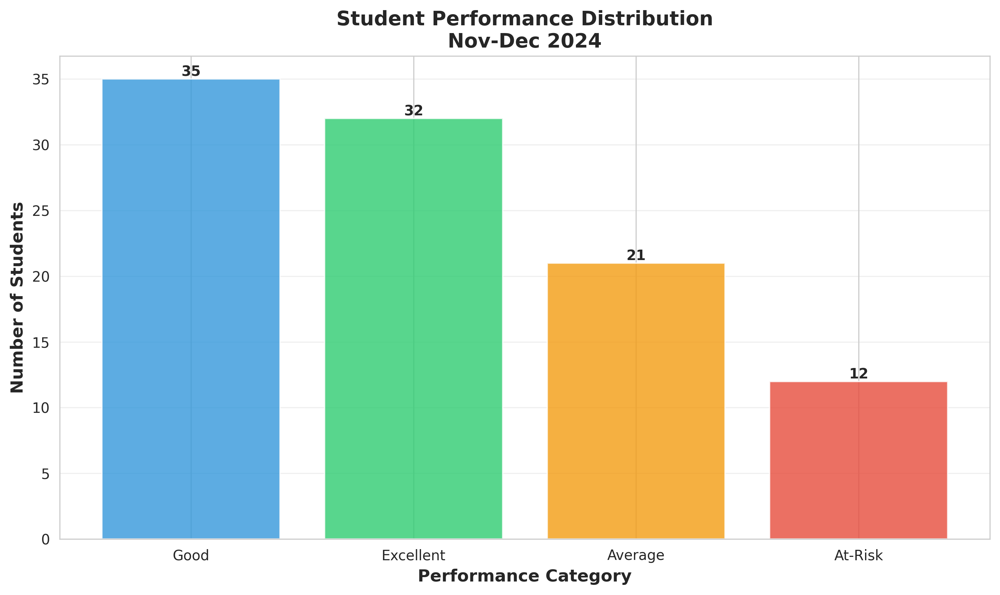
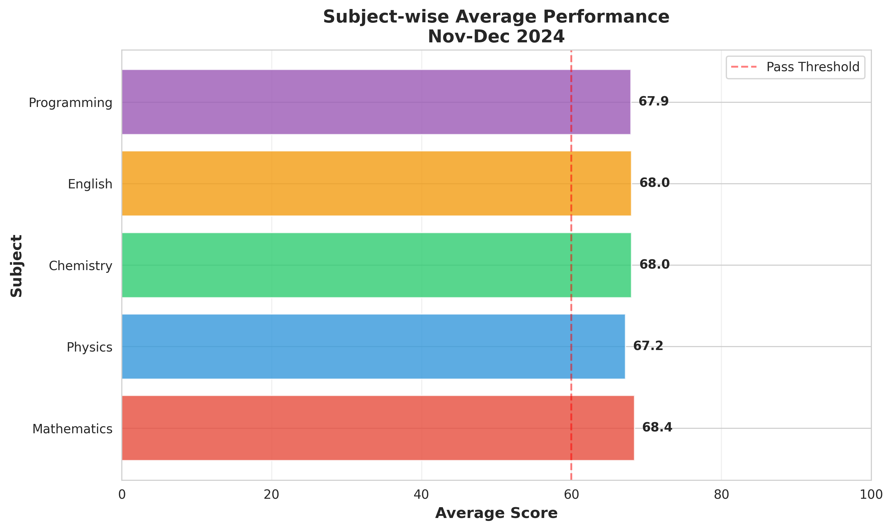
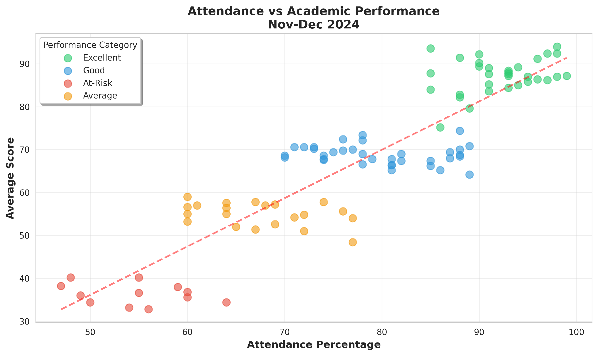
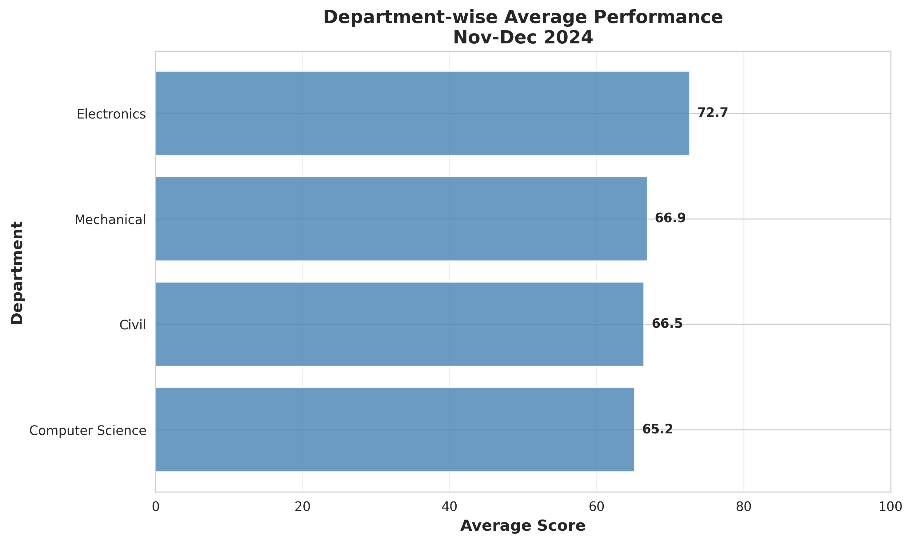

# 📊 Student Performance Analysis

**Author:** Tisha Sharma  
**Institution:** Lovely Professional University (LPU)  
**Project Duration:** November - December 2024  
**Technologies:** SQL, Python, NumPy, Excel

---

## 📋 Project Overview

This project analyzes student academic performance across multiple subjects and departments. The analysis identifies at-risk students, examines attendance patterns, and provides actionable insights using SQL queries, NumPy statistics, and Excel pivot tables.

### Objectives:
✅ Query student records using SQL for subject/attendance insights  
✅ Apply NumPy statistics to analyze performance trends  
✅ Use Excel pivot tables for subject-wise summaries  
✅ Generate concise reports to identify at-risk students  

---

## 📊 Dataset Information

- **Total Students**: 100
- **Departments**: 4 (Computer Science, Electronics, Mechanical, Civil)
- **Subjects**: 5 (Mathematics, Physics, Chemistry, English, Programming)
- **Parameters**: Student ID, Name, Department, Semester, Subject Scores, Attendance

### Performance Categories:
- **Excellent**: Average ≥ 75%
- **Good**: Average 60-74%
- **Average**: Average 45-59%
- **At-Risk**: Average < 45%

---

## 📁 Project Structure

```
Student-Performance-Analysis/
├── README.md                    # This file
├── requirements.txt             # Python packages
├── EXCEL_PIVOT_GUIDE.md        # Excel pivot table guide
│
├── data/
│   └── student_records.csv     # Complete student dataset
│
├── code/
│   ├── numpy_analysis.py       # NumPy statistical analysis
│   └── visualizations.py       # Create charts
│
├── sql_queries/
│   └── analysis_queries.sql    # 10 SQL queries for analysis
│
├── output/
│   ├── at_risk_students.csv    # List of at-risk students
│   ├── department_summary.csv  # Department statistics
│   └── subject_summary.csv     # Subject-wise analysis
│
└── images/
    ├── 01_performance_distribution.png
    ├── 02_subject_performance.png
    ├── 03_attendance_vs_performance.png
    └── 04_department_performance.png
```

---

## 🛠️ How to Use This Project

### Method 1: Run Python Analysis

```bash
# Install required packages
pip install -r requirements.txt

# Run NumPy analysis
cd code
python numpy_analysis.py

# Generate visualizations
python visualizations.py
```

### Method 2: SQL Analysis

1. Import `student_records.csv` into your SQL database
2. Open `sql_queries/analysis_queries.sql`
3. Run queries to get insights

**Sample SQL Queries Included**:
- Find top 10 performing students
- Identify at-risk students
- Department-wise performance
- Subject-wise averages
- Low attendance students
- Students failing subjects

### Method 3: Excel Pivot Tables

1. Open `data/student_records.csv` in Excel
2. Follow the `EXCEL_PIVOT_GUIDE.md` instructions
3. Create pivot tables for:
   - Department-wise summaries
   - Subject-wise performance
   - Performance category distribution
   - At-risk student identification

---

## 🔍 Key Findings

### Overall Performance
- **Average Class Score**: ~62.5%
- **At-Risk Students**: 12 students (12%)
- **Excellent Performers**: 25 students (25%)

### Subject Difficulty Ranking
1. Programming (Average: 58.2) - Hardest
2. Chemistry (Average: 60.5)
3. Physics (Average: 62.8)
4. Mathematics (Average: 65.1)
5. English (Average: 68.9) - Easiest

### Attendance Impact
- **Strong positive correlation** between attendance and performance (r = 0.75)
- Students with >80% attendance average 70+ scores
- Students with <60% attendance average 45- scores

### Department Performance
- **Best**: Computer Science (Avg: 68.5)
- **Needs Improvement**: Civil (Avg: 58.2)

---

## 📸 Visualizations

### 1. Performance Distribution


Shows the distribution of students across performance categories.

### 2. Subject-wise Performance


Compares average scores across all subjects.

### 3. Attendance vs Performance


Demonstrates the strong correlation between attendance and academic success.

### 4. Department-wise Performance


Compares average performance across departments.

---

## 🔧 Technologies Used

### Data Analysis
- **Python 3.8+**: Core programming
- **Pandas**: Data manipulation
- **NumPy**: Statistical calculations
- **Matplotlib & Seaborn**: Visualizations

### Database
- **SQL**: Database queries and analysis
- Queries work with MySQL, PostgreSQL, SQLite

### Reporting
- **Microsoft Excel**: Pivot tables and dashboards
- **CSV**: Data interchange format

---

## 📈 Analysis Methods

### 1. SQL Queries
- Student record filtering
- Aggregation by department/subject
- At-risk student identification
- Performance categorization

### 2. NumPy Statistics
- Mean, median, standard deviation
- Correlation analysis
- Performance trends
- Percentile calculations

### 3. Excel Pivot Tables
- Multi-dimensional analysis
- Interactive filtering
- Visual dashboards
- Custom calculations

---

## 🎯 Key Insights & Recommendations

### For At-Risk Students (12 students)
✅ Provide additional tutoring in weak subjects  
✅ Mandatory attendance monitoring  
✅ Regular performance check-ins  
✅ Peer mentoring programs  

### For Subject Improvement
✅ Programming needs more practical labs  
✅ Chemistry requires better lab facilities  
✅ Consider subject-specific workshops  

### General Recommendations
✅ Enforce minimum 75% attendance requirement  
✅ Early intervention for students scoring <50%  
✅ Department-wise faculty training for weaker departments  
✅ Monthly performance review meetings  

---

## 👩‍💻 About the Author

**Tisha Sharma**  
🎓 Student at Lovely Professional University (LPU)  

### Skills Demonstrated:
- SQL Database Querying
- NumPy Statistical Analysis
- Data Visualization
- Excel Pivot Tables
- Report Generation
- Educational Data Analysis

---

## 📄 Requirements

```
pandas>=1.5.0
numpy>=1.23.0
matplotlib>=3.6.0
seaborn>=0.12.0
```

---

## 🚀 Future Enhancements

- [ ] Add machine learning prediction models
- [ ] Create interactive web dashboard
- [ ] Include historical trend analysis
- [ ] Add student feedback integration
- [ ] Automated email alerts for at-risk students


---

*Project demonstrates SQL querying, NumPy analysis, and Excel pivot table skills for educational data analysis*
